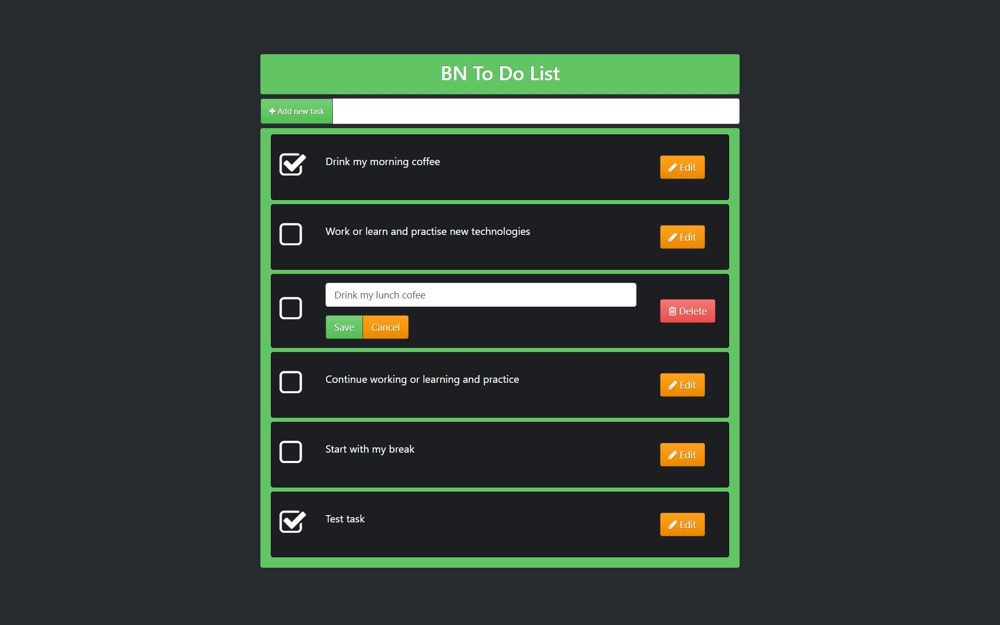
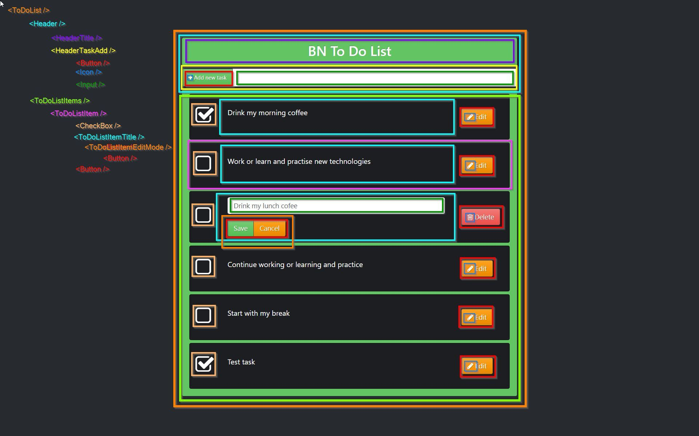

# PROJECT PLAN

## 1. Make a screenshot of the app

## 2. Separate visually the components

## 3. Name the components

- ToDoList
- Header
- HeaderTitle
- HeaderTaskAdd
- ToDoListItems
- ToDoListItem
- ToDoListItemTitle
- ToDoListItemEditMode
- Button
- Icon
- Input
- Checkbox

## 4. Create Hierarchy structure

- `<ToDoList />`
  - `<Header />`
    - `<HeaderTitle />`
    - `<HeaderTaskAdd />`
      - `<Button />` (Add button)
        - `<Icon />` (Plus icon)
      - `<Input />`
  - `<ToDoListItems />`
    - `<ToDoListItem />`
      - `<Checkbox />`
      - `<ToDoListItemTitle />`
        - `<ToDoListItemEditMode />`
          - `<Button />` (Save button)
          - `<Button />` (Cancel button)
      - `<Button />` (Edit button)
        - `<Icon />` (Edit icon)
      - `<Button />` (Delete button)
        - `<Icon />` (Trash icon)

## 5. Folder structure

- [`components`]
  - [`Header`]
    - Header.jsx
    - HeaderTitle.jsx
    - HeaderTaskAdd.jsx
  - [`ToDoListItems`]
    - ToDoListItems.jsx
    - [`ToDoListItem`]
      - ToDoListItem.jsx
      - ToDoListItemTitle.jsx
      - ToDoListItemEditMode.jsx
  - [`UI`]
    - [`Checkbox`]
      - Checkbox.jsx
      - Checkbox.css
    - [`Loading`]
      - Loading.css
      - Loading.jsx
    - Button.jsx
    - Icon.jsx
    - Input.jsx
- [`containers`]
  - ToDoList.jsx
