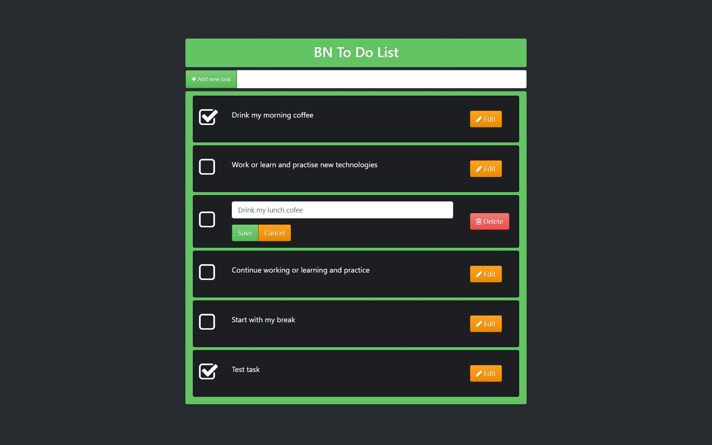
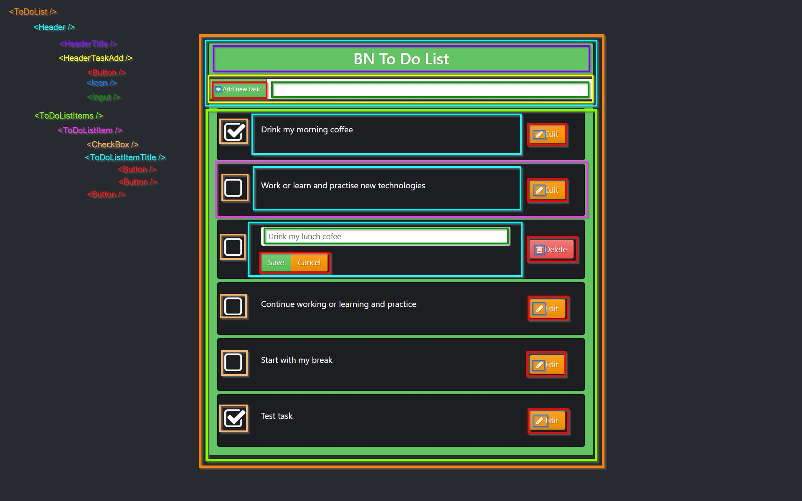

# PROJECT PLAN

## 1. Make a screenshot of the app

    
## 2. Separate visually the components

## 3. Name the components

- ToDoList
- Header
- HeaderTitle
- HeaderTaskAdd
- ToDoListItems
- ToDoListItem
- ToDoListItemTitle
- Button
- Icon
- Input
- Checkbox

## 4. Create Hierarchy structure

- `<ToDoList />`
  - `<Header />`
    - `<HeaderTitle />`
    - `<HeaderTaskAdd />`
      - `<Button />` (Add button)
        - `<Icon />` (Plus icon)
      - `<Input />`
  - `<ToDoListItems />`
    - `<ToDoListItem />`
      - `<Checkbox />`
      - `<ToDoListItemTitle />`
        - `<Button />` (Save button)
        - `<Button />` (Cancel button)
      - `<Button />` (Edit button)
        - `<Icon />` (Edit icon)
      - `<Button />` (Delete button)
        - `<Icon />` (Trash icon)

## 5. Folder structure

- [`components`]
  - [`Header`]
    - Header.js
    - [`HeaderTitle`]
      - HeaderTitle.js
    - [`HeaderTaskAdd`]
      - HeaderTaskAdd.js
  - [`ToDoListItems`]
    - ToDoListItems.js
    - [`ToDoListItem`]
      - ToDoListItem.js
  - [`UI`]
    - [`Button`]
      - Button.js
    - [`Icon`]
      - Icon.js
    - [`Input`]
      - Input.js
    - [`Checkbox`]
      - Checkbox.js
- [`containers`]
  - [`ToDoList`]
    - ToDoList.js

    